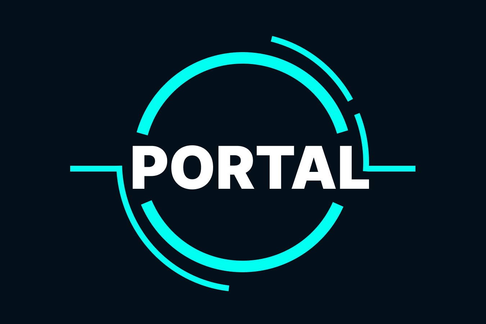

<p align="center" >

</p>

# `portal`
`portal` lets you expose your locally running web server via a public URL.
Written in Rust. Built completely with async-io on top of tokio.

1. [Install](#install)
2. [Usage Instructions](#usage)
3. [Host it yourself](#host-it-yourself)

# Install

## Cargo
```bash
cargo install portal
```

## Everywhere
Or **Download a release for your target OS here**: [portal/releases](https://github.com/illusion-tech/portal/releases)

# Usage
## Quick Start
```shell script
portal --port 8000
```
The above command opens a tunnel and forwards traffic to `localhost:8000`.

## More Options:
```shell script
Expose your local web server to the Internet with a public url.

Usage: portal [OPTIONS] [COMMAND]

Commands:
  set-auth  Store the API Authentication key
  help      Print this message or the help of the given subcommand(s)

Options:
  -v, --verbose
          A level of verbosity, and can be used multiple times
  -k, --key <KEY>
          Sets an API authentication key to use for this portal
  -s, --sub-domain <SUB_DOMAIN>
          Specify a sub-domain for this portal
      --host <LOCAL_HOST>
          Sets the HOST (i.e. localhost) to forward incoming portal traffic to [default: localhost]
  -t, --use-tls
          Sets the protocol for local forwarding (i.e. https://localhost) to forward incoming portal traffic to
  -p, --port <PORT>
          Sets the port to forward incoming portal traffic to on the target host [default: 8000]
      --dashboard-port <DASHBOARD_PORT>
          Sets the address of the local introspection dashboard
  -h, --help
          Print help
  -V, --version
          Print version
```

# Host it yourself
1. Compile the server for the musl target. See the `musl_build.sh` for a way to do this trivially with Docker!
2. See `Dockerfile` for a simple alpine based image that runs that server binary.
3. Deploy the image where ever you want.

## Testing Locally
```shell script
# Run the Server: expects TCP traffic on 8080 and control websocket on 5000
ALLOWED_HOSTS="localhost" cargo run --bin portal_server

# Run a local portal client talking to your local portal_server
CTRL_HOST="localhost" CTRL_PORT=5000 CTRL_TLS_OFF=1 cargo run --bin portal -- -p 8000

# Test it out!
# Remember 8080 is our local portal TCP server
curl -H 'Host: <subdomain>.localhost' "http://localhost:8080/some_path?with=somequery"
```
See `portal_server/src/config.rs` for the environment variables for configuration.
